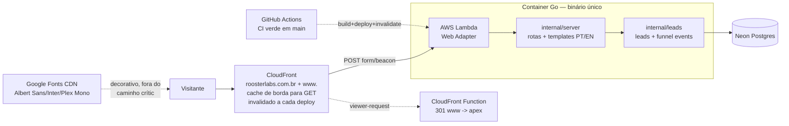

# Arquitetura — estado atual

Mantido pela skill `escopar-epico` (propõe a mudança) e verificado pelo `fechar-epico` (o doc reflete o entregue). Diagrama descreve o sistema **como está em produção** + a mudança aceita em curso, quando houver.

## Visão geral

**Estado entregue:** épico 001 (landing bilíngue em produção, captura de leads, funil instrumentado), épico 002 (copy v0.4, débito técnico de infra/segurança) e épico 003 (copy/identidade v0.5) — ver `epics/done/`.

## Rotas

| Rota | O que faz |
|---|---|
| `GET /` | landing PT-BR (copy v0.5) |
| `GET /en/` | landing EN (copy v0.5) |
| `POST /form/{step}` | processa etapa do carrossel HTMX e retorna próximo fragmento |
| `POST /event/view` | grava pageview first-party (idioma + path + UTMs lidos de `location.search` no cliente, não do HTML cacheado) |
| `GET /healthz` | health check |
| `GET /static/*` | assets embutidos no binário (inclui `og.png`/`og-en.png`, `htmx.min.js` vendorado) |

## Dados

Schema inicial no Postgres (Neon):

- `leads`: lead consolidado por token (perfil, objetivo, maturidade, desafio, email, linkedin, idioma, UTMs, timestamps).
- `funnel_events`: eventos de funil (`view`, `answer`, `submit`) com `step`, `payload` JSON e metadados de aquisição.

Migração fonte da verdade: `internal/leads/migrations/001_init.sql`.

## Detalhes entregues no épico 003 (landing v0.5)

- **Fontes:** display migrou de Fraunces (serifa, aposentada pelo guardrail da identidade) para **Albert Sans** (300/400/500); corpo segue Inter, meta segue IBM Plex Mono. Guardrail do peso fino codificado no CSS: 300 só em texto ≥36px (media query em 600px derivada do clamp do h1 — recalibrar se o clamp mudar). Mesma exceção de CDN decorativo de sempre.
- **Hero v0.5:** tagline como H1 (só o prefixo "AI" em âmbar, via span — a palavra inteira colorida quebra o trocadilho em Albert Sans), sem eyebrow, CTA âncora para `#lead-form`, linha de fechamento própria.
- **Assets novos em `/static/`:** `rooster-watermark.webp` (26 KB, marca d'água do hero a 16%, some em mobile) e `rooster-icon.png` (112px/12,8 KB, derivado do master de 1024px em `roosterlabs-marketing/brand/`; rodapé com wordmark "Rooster**Labs**" em Albert Sans 500).
- **Tokens semânticos:** `--ok-500`/`--no-500` para ✓/✗ da tabela de comparação — únicos consumidores são `.mark-ok`/`.mark-no` (regra da identidade travada por teste).
- **OG v0.5 + cache do LinkedIn:** os arquivos `og.png`/`og-en.png` mantêm os nomes entre versões — o CloudFront invalida no deploy, mas **o LinkedIn cacheia por URL**: após trocar OG, forçar re-scrape no Post Inspector (senão o preview velho persiste).

## Detalhes entregues no épico 002 (débito técnico + sync v0.4)

- **Fontes:** ver épico 003 acima (Fraunces→Albert Sans); a decisão de CDN decorativo com fallback de CSS vem do 002 — diferente do htmx, vendorado localmente por ser caminho crítico do form.
- **OG image por idioma:** `ogImageFile(lang)` em `internal/server/server.go` escolhe `og.png` (PT) ou `og-en.png` (EN); metatags incluem `og:image:width=1200`/`height=630`/`type=image/png`. Fecha o G1 do épico 001 (SVG não renderizava preview em LinkedIn/WhatsApp).
- **UTM à prova de cache:** `web/static/app.js` lê `location.search` no cliente e sobrescreve incondicionalmente os hidden inputs do form (passo 1) e o payload do beacon — nunca confia no HTML servido pelo CloudFront, que cacheia ignorando query string. Fecha o G2 do épico 001.
- **Deploy CI-gated:** `deploy.yml` dispara via `workflow_run` do workflow `CI` (só com `conclusion == 'success'`), não mais por `push` direto — um lint quebrado não vai mais ao ar.
- **Cache do CloudFront invalidada a cada deploy:** último passo do `deploy.yml` roda `create-invalidation --paths "/*"` — sem isso, merges em `main` ficavam invisíveis em produção por até 24h (TTL default da cache policy). Ver `infra/README.md`.
- **Permissão dupla do Lambda Function URL codificada no Terraform:** `aws_lambda_permission.function_url_invoke` (era drift manual via CLI desde o épico 001).
- **`www.` redireciona para o apex:** via CloudFront Function (`viewer-request`, borda), não pelo Go — ver `infra/README.md`.
- **Operação sem root:** usuário IAM `ppbrasil-admin` (`AdministratorAccess` + `SignInLocalDevelopmentAccess`) substitui o uso de credenciais root da conta AWS.
