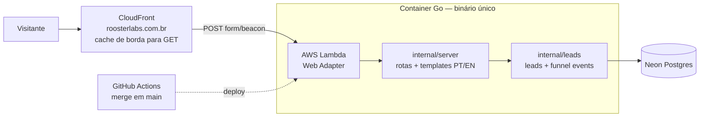

# Arquitetura — estado atual

Mantido pela skill `escopar-epico` (propõe a mudança) e verificado pelo `fechar-epico` (o doc reflete o entregue). Diagrama descreve o sistema **como está em produção** + a mudança aceita em curso, quando houver.

## Visão geral

**Estado alvo do épico 001:** landing bilíngue em produção com captura de leads e instrumentação de funil por pergunta.

## Rotas

| Rota | O que faz |
|---|---|
| `GET /` | landing PT-BR |
| `GET /en/` | landing EN |
| `POST /form/{step}` | processa etapa do carrossel HTMX e retorna próximo fragmento |
| `POST /event/view` | grava pageview first-party (idioma + path + UTMs) |
| `GET /healthz` | health check |
| `GET /static/*` | assets embutidos no binário |

## Dados

Schema inicial no Postgres (Neon):

- `leads`: lead consolidado por token (perfil, objetivo, maturidade, desafio, email, linkedin, idioma, UTMs, timestamps).
- `funnel_events`: eventos de funil (`view`, `answer`, `submit`) com `step`, `payload` JSON e metadados de aquisição.

Migração fonte da verdade: `internal/leads/migrations/001_init.sql`.
