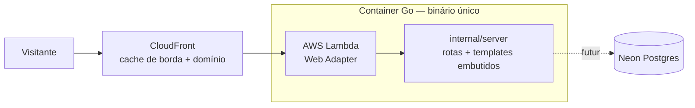

# Arquitetura — estado atual

Mantido pela skill `escopar-epico` (propõe a mudança) e verificado pelo `fechar-epico` (o doc reflete o entregue). Diagrama descreve o sistema **como está em produção** + a mudança aceita em curso, quando houver.

## Visão geral

**Estado: pré-deploy.** Nada provisionado ainda (ver `infra/README.md`).

## Rotas

| Rota | O que faz |
|---|---|
| `GET /` | página índice (placeholder — landing definitiva pendente de épico) |
| `GET /healthz` | health check |
| `GET /static/*` | assets embutidos no binário |

## Dados

Nenhuma tabela ainda. Postgres (Neon) entra com o primeiro épico que capturar dados.
