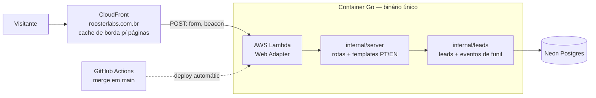

# Épico 001 — Landing page no ar capturando leads qualificados

**Estado:** em-execução
**Origem:** marketing · 2026-07-04
**Prioridade servida:** MVP + 2–3 clientes pagantes — a landing é o passo 1 do OKR de GTM (sem ela, toda conversa com prospect e todo tráfego é aprendizado ruidoso; ver `roosterlabs-marketing/gtm-okrs.md`, Objetivo 1).

## Output / Outcome (por que este épico existe)

**Output:** a landing page da RoosterLabs no ar em `roosterlabs.com.br`, nos dois idiomas (PT-BR na raiz, EN em `/en/`), renderizando fielmente a copy v0.3 e a identidade visual v0.3, e capturando leads qualificados através do formulário em carrossel de 5 etapas — com cada lead persistido e consultável por Pedro.

**Outcome (horizonte do OKR, não deste épico isolado):** habilitar as KRs do Objetivo 1 — 10 reações qualificadas de prospects à mensagem, baseline de conversão ≥8% de tráfego qualificado, top 5 objeções/claims documentados.

- **Critério de sucesso:**
  - Página acessível em produção no domínio final, nos dois idiomas, com navegação entre eles.
  - Fluxo de lead ponta a ponta: visitante completa o carrossel → lead gravado com todas as variáveis de aprendizado (perfil, objetivo, maturidade, desafio, idioma da página, UTMs) → Pedro consegue consultar os leads sem depender de terceiros.
  - Preview de link (OG) correto ao compartilhar no LinkedIn/WhatsApp.
  - Página utilizável em mobile (maioria do tráfego de LinkedIn é mobile).
- **Restrições:**
  - Empresa solo: operação da página não pode exigir atenção humana recorrente.
  - Pré-receita: custo de infra o mais próximo possível de zero.
  - Copy, estrutura, lógica de conversão e identidade visual são propriedade de marketing e **não podem ser alteradas pela engenharia** — problema encontrado sobe como nota, não vira patch local.
  - DNS de `roosterlabs.com.br` está no Registro.br.
- **Fora de escopo:**
  - Página de sign-up (Objetivo 2 do OKR).
  - LinkedIn Ads e qualquer instrumentação de paid (Objetivo 3).
  - Dashboard de analytics além de consulta simples de leads; A/B testing; CMS; blog; exibição de preço.
  - E-mails transacionais/autoresponder para leads (contato inicial será manual de propósito — são conversas de descoberta).

## Fontes da verdade (marketing — ler antes de escopar)

| Arquivo | O que fornece |
|---|---|
| `roosterlabs-marketing/landing-page.md` (v0.3) | Copy integral PT/EN, estrutura da página, spec do form em carrossel (5 etapas, e-mail por último), variáveis por lead e instrumentação desejada |
| `roosterlabs-marketing/visual-identity.md` (v0.3) | Paleta (tokens), tipografia (Fraunces/Source Serif 4/Inter/Plex Mono), regras de spotlight/translucidez, família do galo |
| `roosterlabs-marketing/comms-foundations.md` | Tom, guardrails (nunca sugerir humano no loop de entrega) |
| `roosterlabs-marketing/brand/web/` | Assets prontos: galo hero otimizado (webp), OG image, favicon provisório |
| `roosterlabs-marketing/gtm-okrs.md` | KRs que a página serve |

Nota de contexto: existiu um protótipo funcional (HTML estático + form) construído na sessão de marketing e deletado deliberadamente em favor deste épico — as especificações que valem estão nos arquivos acima. Decisão anterior de marketing por hosting específico foi revogada: infra é decisão de engineering dentro da stack decidida.

## Escopo proposto (engineering — skill `escopar-epico`)

Escopado em 2026-07-06. Decisões alinhadas com Pedro nesta sessão:

1. **Bootstrap da infra de produção entra neste épico.** O DoD exige página em produção no domínio final — sem infra não há fechamento por evidência. Épico de infra separado seria épico técnico sem outcome (proibido pelo workflow). Passos que exigem credenciais (conta AWS, Registro.br, Neon) viram tarefas do Pedro na quebra.
2. **Carrossel via HTMX, uma etapa por requisição.** Cada resposta vai ao servidor na hora e é gravada como evento; o funil de abandono por pergunta (pedido na spec de marketing) sai como subproduto, sem sistema de tracking separado. Alternativas rejeitadas: carrossel JS client-side (dois sistemas para manter, mais JS custom — contra a stack decidida) e "sem funil" (abre mão de dado que o KR pede).
3. **Visitas via beacon first-party.** O CloudFront serve a página da borda — o servidor não vê a maioria das visitas. Um beacon (`POST`, não cacheável) grava pageview com idioma + UTM na mesma tabela de eventos; a conversão do KR (≥8%) vira uma query SQL. Rejeitados: logs do CloudFront (bots, análise manual semanal) e analytics de terceiro (custo mensal, dado fora do nosso banco).
4. **Consulta de leads via console do Neon**, com queries prontas documentadas. Zero código de admin para manter; se a consulta doer ≥3 vezes, rota admin vira tarefa futura (regra do atrito).

**Desafios de long shot:** nenhum encontrado — o "fora de escopo" do épico já corta o que seria. Único item desafiado e mantido: instrumentação por pergunta (parece sofisticação pré-tráfego, mas alimenta diretamente o KR de top-5 dores e custa pouco na opção 2).

**Proposta de decisão de engenharia (registrar em `decisions.md` no aceite):** IaC em **Terraform** — ferramenta dominante na rede AWS do Pedro, conhecimento transferível para a VPC futura. DNS: Registro.br delega para Route 53 (Registro.br não resolve apex → CloudFront; custo ~US$0,50/mês).

**Dependências upstream (bloqueiam deploy, não o escopo):**
- E-mail de contato do footer — "a definir" em `landing-page.md` (marketing).
- Favicon: redução flat marcada como obrigatória e pendente em `visual-identity.md`; usamos o `favicon.svg` provisório e trocamos quando marketing vetorizar.

### Mudança no sistema

**Antes:** um servidor Go com página placeholder, nunca deployado. Sem banco de dados, sem domínio, sem pipeline de deploy. Nada visível ao público.

**Depois:** o mesmo servidor, agora em produção em `roosterlabs.com.br`, servindo a landing nos dois idiomas e gravando leads e eventos de funil no primeiro banco de dados da empresa. Todo merge em `main` vai ao ar sozinho.

**Rotas — de 3 para 7:**

| Rota | O que faz |
|---|---|
| `GET /` | landing PT-BR (copy v0.3) |
| `GET /en/` | landing EN (copy v0.3) |
| `POST /form/{etapa}` | recebe a resposta de uma pergunta do carrossel, grava o evento e devolve a próxima tela; a etapa final (e-mail + LinkedIn) consolida o lead |
| `POST /event/view` | beacon de visita (idioma + UTM) |
| `GET /healthz`, `GET /static/*` | já existem (health check, assets) |

**Dados — primeiras tabelas (Neon Postgres, SQL via sqlc no pacote `internal/leads`):**

| Tabela | Guarda |
|---|---|
| `leads` | um registro por envio completo: perfil, objetivo, maturidade, desafio, e-mail, URL do LinkedIn, idioma da página, UTMs, timestamps |
| `funnel_events` | um registro por acontecimento: visita, resposta de cada pergunta, envio — ligados por token anônimo. É daqui que saem o funil de abandono e a taxa de conversão |

**Infra — de nada para produção mínima (tudo como código, em `infra/`):** conta AWS com deploy via OIDC (sem secrets estáticos), imagem no ECR, Lambda + Function URL, CloudFront com certificado (ACM) e domínio, DNS delegado ao Route 53, Neon free tier. Workflow de deploy em `.github/workflows/`. Custo alvo: ~US$0,50/mês (Route 53); resto no free tier.

**Fora da mudança:** nenhuma alteração em copy, estrutura ou identidade (propriedade de marketing, renderizadas fielmente); nenhum e-mail transacional; nenhum admin/dashboard.

**Atualização proposta de `docs/architecture.md`:** substituir o diagrama, a tabela de rotas e a seção de dados pelos acima, e remover o aviso "pré-deploy". Mergeada com o aceite deste épico.

## DoD — Definition of Done (congelado no aceite de 2026-07-06)

| # | Item verificável | Evidência de fechamento |
|---|---|---|
| 1 | `https://roosterlabs.com.br/` serve a landing PT-BR e `/en/` a EN, com navegação entre idiomas nos dois sentidos e copy v0.3 fiel | acesso em produção + conferência da copy contra `landing-page.md` |
| 2 | Fluxo ponta a ponta em produção: completar o carrossel → lead gravado com perfil, objetivo, maturidade, desafio, idioma e UTMs | submissão de teste real + query no banco mostrando o registro completo |
| 3 | Funil instrumentado: eventos de visita e de cada pergunta gravados; queries de conversão e de abandono documentadas | queries executadas retornando os eventos da submissão de teste |
| 4 | Pedro consulta leads e conversão sozinho no console do Neon com as queries documentadas | Pedro executa e confirma |
| 5 | Preview de link (OG) correto no LinkedIn e WhatsApp | screenshot dos previews |
| 6 | Página utilizável em mobile (viewport ~390px) | screenshot mobile das seções + form completo |
| 7 | Footer com e-mail de contato definido por marketing | e-mail presente na página (depende de upstream) |
| 8 | Deploy automático: merge em `main` → produção, sem passo manual | um merge de teste dispara o pipeline e a mudança aparece em produção |
| 9 | Testes no CI verdes (build + vet + test + lint) em todo PR do épico | histórico do CI |
| 10 | `docs/architecture.md` e `infra/README.md` refletem o estado entregue | diff dos docs no fechamento |
| 11 | Custo de infra ≤ ~US$1/mês | fatura/console AWS + Neon |

## Log de validação (skill `validar-escopo`)

- 2026-07-06 — **revisão solicitada**
  - Escopo e "Mudança no sistema" estão compreensíveis para não-dev; o desenho atende ao output do épico e preserva os guardrails de marketing.
  - DoD cobre o critério de sucesso (publicação, captação, instrumentação, consulta por Pedro, mobile, OG, CI, docs e custo) e não há long shot adicional.
  - Pendência obrigatória para aceite: definir o e-mail de contato do footer (PT/EN) em `roosterlabs-marketing/landing-page.md`. Sem isso, o item 7 do DoD fica bloqueado e o deploy não fecha por evidência.
  - Pendência de decisão de mensagem/risco: uso de ™ em "AUTO-AUTENTICIDADE™" e "AUTO-AUTHENTICITY™" (manter ou remover) para congelar copy sem ambiguidade antes da execução.
  - Próximo passo: após registrar essas duas decisões no marketing, rodar `validar-escopo` novamente para `aprovado` e congelamento do DoD.
- 2026-07-06 — **aprovado**
  - Decisões de marketing registradas: footer com `contact@roosterlabs.com.br` e manutenção de ™ em "AUTO-AUTENTICIDADE™"/"AUTO-AUTHENTICITY™".
  - DoD congelado nesta data. Qualquer alteração posterior no DoD exige novo ciclo de validação registrado neste log.

## Quebra (skill `quebrar-epico`)

Sequência ordenada por dependência. `gh` não está disponível neste ambiente (CLI ausente e sem remoto configurado), então esta lista é a fonte oficial das tarefas.

### Progresso de execução (2026-07-06)

- **Implementado em código/docs:** T1, T2, T3, T4, T5, T6, T7, T8, T10, T11, T12.
- **Parcial (falta evidência visual):** T9 (estilos mobile aplicados; faltam screenshots de verificação em viewport ~390px).
- **Pendente por credenciais/ambiente externo:** apply Terraform em conta AWS, configuração de secrets no GitHub, deploy em `main` e validação em produção do domínio final.
- **Bloqueio de validação local nesta máquina:** indisponibilidade de `go` e daemon do Docker no terminal atual impediu execução de `make test`/`go test` local e validação containerizada; diagnóstico via análise estática (`get_errors`) sem erros de editor.

### T1 — Base de dados e migração inicial (leads + funnel_events)

- **Comportamento observável:** subir schema inicial no Postgres com tabelas `leads` e `funnel_events` + índices mínimos para queries de conversão/abandono.
- **Blast radius declarado (tocar):** `internal/leads/migrations/*.sql`, `internal/leads/README.md` (ou equivalente), `Makefile` (se houver alvo para migração).
- **Blast radius declarado (ler antes):** `docs/architecture.md`, `infra/README.md`, seção DoD deste épico.
- **Plano de teste (edge cases):**
  - aplicar migração em banco vazio;
  - reaplicar (idempotência via controle de versão);
  - validar `NOT NULL` em campos obrigatórios de lead;
  - inserir eventos sem lead finalizado (token anônimo) e confirmar que schema permite;
  - inserir UTM ausente e confirmar nullable nos campos opcionais.
- **Traço ao DoD:** itens 2, 3, 4.
- **Orçamento de diff:** ~130 linhas (SQL + doc curta).

### T2 — Repositório de dados (`internal/leads`) e conexão por `DATABASE_URL`

- **Comportamento observável:** servidor inicia com repositório de leads/eventos conectado ao Postgres; falha de conexão gera erro explícito na inicialização.
- **Blast radius declarado (tocar):** `internal/leads/store.go`, `internal/leads/models.go`, `cmd/server/main.go`, `internal/server/server.go`, `go.mod` (se dependência nova).
- **Blast radius declarado (ler antes):** `internal/server/server.go`, `cmd/server/main.go`, migração da T1.
- **Plano de teste (edge cases):**
  - `DATABASE_URL` ausente em modo produção configurado;
  - URL inválida (erro propagado);
  - timeout de conexão;
  - teste de escrita/leitura básica em tabela de eventos.
- **Traço ao DoD:** itens 2, 3, 4.
- **Orçamento de diff:** ~150 linhas (sem código gerado).

### T3 — Renderização i18n da landing (rotas `/` e `/en/`) com estrutura final

- **Comportamento observável:** `GET /` renderiza PT-BR e `GET /en/` renderiza EN com navegação entre idiomas.
- **Blast radius declarado (tocar):** `internal/server/server.go`, `web/templates/index.html.tmpl`, `web/templates/index.en.html.tmpl` (novo), `internal/server/server_test.go`.
- **Blast radius declarado (ler antes):** `roosterlabs-marketing/landing-page.md`, `roosterlabs-marketing/visual-identity.md`, testes atuais de `internal/server`.
- **Plano de teste (edge cases):**
  - rota `/en/` retorna 200 e conteúdo EN;
  - links de troca de idioma corretos nos dois sentidos;
  - content-type HTML correto;
  - rota desconhecida continua 404.
- **Traço ao DoD:** item 1.
- **Orçamento de diff:** ~150 linhas (templates podem ser quebrados em tarefa seguinte se exceder).

### T4 — Metadados OG por idioma e fallback seguro

- **Comportamento observável:** páginas PT e EN entregam metatags OG/Twitter consistentes para preview em LinkedIn/WhatsApp.
- **Blast radius declarado (tocar):** `web/templates/index.html.tmpl`, `web/templates/index.en.html.tmpl`, `internal/server/server_test.go`.
- **Blast radius declarado (ler antes):** `roosterlabs-marketing/brand/web/` (asset OG), `roosterlabs-marketing/landing-page.md`.
- **Plano de teste (edge cases):**
  - presença de `og:title`, `og:description`, `og:image`, `og:url`;
  - `og:locale` correto para cada idioma;
  - ausência de quebra quando asset OG faltar (fallback para path default documentado).
- **Traço ao DoD:** item 5.
- **Orçamento de diff:** ~90 linhas.

### T5 — Endpoint `POST /event/view` com token anônimo + UTMs

- **Comportamento observável:** beacon grava evento de visita com idioma, path e UTMs sem depender de JS de terceiro.
- **Blast radius declarado (tocar):** `internal/server/server.go`, `internal/server/events_handler.go` (novo), `internal/leads/store.go`, `internal/server/server_test.go`.
- **Blast radius declarado (ler antes):** T2, seção Instrumentação em `roosterlabs-marketing/landing-page.md`.
- **Plano de teste (edge cases):**
  - payload válido grava evento e retorna 202/204;
  - método diferente de POST rejeitado;
  - JSON inválido retorna 400;
  - UTM ausente mantém evento válido;
  - token ausente gera token novo e retorna no cookie/resposta (conforme implementação definida).
- **Traço ao DoD:** item 3.
- **Orçamento de diff:** ~140 linhas.

### T6 — Carrossel HTMX (passos 1..5) com persistência por passo

- **Comportamento observável:** `POST /form/{etapa}` processa cada etapa, grava evento de resposta e devolve próximo fragmento HTMX até confirmação final.
- **Blast radius declarado (tocar):** `internal/server/server.go`, `internal/server/form_handler.go` (novo), `web/templates/form_step_*.html.tmpl` (novos), `internal/leads/store.go`, `internal/server/server_test.go`.
- **Blast radius declarado (ler antes):** spec do formulário em `roosterlabs-marketing/landing-page.md`, T5 para token/sessão.
- **Plano de teste (edge cases):**
  - etapa fora do intervalo retorna 404/400;
  - resposta vazia em campo obrigatório retorna erro de validação;
  - opção `Outro` sem texto complementar;
  - repetição de submissão da mesma etapa não duplica estado inválido;
  - usuário começa no meio (sem token) recebe fluxo consistente.
- **Traço ao DoD:** item 2, item 3.
- **Orçamento de diff:** ~150 linhas (se passar, dividir por etapa: T6a/T6b).

### T7 — Consolidação do lead final (email + LinkedIn) e pós-envio

- **Comportamento observável:** etapa final consolida respostas anteriores em `leads`, marca evento de submit e retorna mensagem de sucesso definida no marketing.
- **Blast radius declarado (tocar):** `internal/server/form_handler.go`, `internal/leads/store.go`, `internal/leads/models.go`, `web/templates/form_success.html.tmpl`, `internal/server/server_test.go`.
- **Blast radius declarado (ler antes):** T6, `roosterlabs-marketing/landing-page.md` (copy pós-envio e campos finais).
- **Plano de teste (edge cases):**
  - e-mail inválido rejeitado;
  - LinkedIn URL inválida rejeitada/normalizada;
  - submit duplicado com mesmo token não cria leads duplicados;
  - ausência de respostas anteriores bloqueia consolidação com erro claro;
  - concorrência (duplo clique) com comportamento idempotente.
- **Traço ao DoD:** item 2.
- **Orçamento de diff:** ~140 linhas.

### T8 — Query pack operacional para Pedro (console Neon)

- **Comportamento observável:** documentação entrega queries prontas para listar leads, taxa de conversão e abandono por pergunta sem código extra.
- **Blast radius declarado (tocar):** `infra/README.md` e/ou `internal/leads/queries.sql`, referência em `README.md`.
- **Blast radius declarado (ler antes):** schema da T1, eventos das T5-T7, DoD.
- **Plano de teste (edge cases):**
  - query de conversão com zero visitas não divide por zero;
  - filtro por idioma PT/EN;
  - ordenação por recência;
  - abandono com perguntas sem eventos na janela retorna zero, não erro.
- **Traço ao DoD:** item 3, item 4.
- **Orçamento de diff:** ~120 linhas.

### T9 — Mobile usability hardening (390px) + smoke tests de rendering

- **Comportamento observável:** landing e carrossel ficam utilizáveis em viewport ~390px (sem overflow horizontal, CTA e inputs clicáveis).
- **Blast radius declarado (tocar):** `web/templates/index*.html.tmpl`, `web/static/*` (CSS/JS), `internal/server/server_test.go` (smokes de estrutura).
- **Blast radius declarado (ler antes):** `roosterlabs-marketing/visual-identity.md` (tipografia/tokens), T3/T6.
- **Plano de teste (edge cases):**
  - textos longos quebram linha sem estourar layout;
  - teclado mobile não oculta CTA de submit final;
  - orientação landscape mantém usabilidade mínima;
  - degradê/efeitos não comprometem contraste.
- **Traço ao DoD:** item 6.
- **Orçamento de diff:** ~150 linhas.

### T10 — IaC base (AWS + DNS + deploy path) versionada em `infra/`

- **Comportamento observável:** infraestrutura mínima declarada como código (ECR, Lambda URL, CloudFront, Route 53/ACM, variáveis para Neon), com guia de apply/release.
- **Blast radius declarado (tocar):** `infra/terraform/*` (novo), `infra/README.md`, `.gitignore` (se necessário).
- **Blast radius declarado (ler antes):** `infra/README.md`, `docs/architecture.md`, decisão de IaC em `decisions.md`.
- **Plano de teste (edge cases):**
  - `terraform validate` limpo;
  - `terraform plan` sem destruição inesperada em ambiente novo;
  - variáveis obrigatórias sem default seguro falham com mensagem clara;
  - políticas mínimas de permissão para deploy.
- **Traço ao DoD:** item 8, item 11.
- **Orçamento de diff:** código gerado/estado excluído; código humano ~150 linhas por módulo.

### T11 — Pipeline de deploy em `main` (build/push/update Lambda)

- **Comportamento observável:** merge em `main` publica nova versão automaticamente sem passo manual.
- **Blast radius declarado (tocar):** `.github/workflows/deploy.yml` (novo), `.github/workflows/ci.yml` (integração), `README.md`.
- **Blast radius declarado (ler antes):** workflow atual de CI, IaC da T10, `Dockerfile`.
- **Plano de teste (edge cases):**
  - bloqueio de deploy se CI falhar;
  - branch diferente de `main` não dispara deploy;
  - falha de push ECR aborta update de Lambda;
  - logs de release exibem image digest e versão implantada.
- **Traço ao DoD:** item 8, item 9.
- **Orçamento de diff:** ~140 linhas.

### T12 — Documentação final da mudança no sistema e operação

- **Comportamento observável:** docs refletem o estado entregue (arquitetura pós-deploy, rotas, dados, operação de infra e consulta).
- **Blast radius declarado (tocar):** `docs/architecture.md`, `infra/README.md`, `README.md`.
- **Blast radius declarado (ler antes):** mudanças consolidadas de T1-T11, seção Mudança no sistema deste épico.
- **Plano de teste (edge cases):**
  - instruções reproduzíveis em ambiente limpo;
  - rotas listadas batem com handler real;
  - referências cruzadas de arquivo não quebradas.
- **Traço ao DoD:** item 10.
- **Orçamento de diff:** ~120 linhas.

Ordem de ataque confirmada para execução: **T1 → T2 → T3 → T4 → T5 → T6 → T7 → T8 → T9 → T10 → T11 → T12**.

## Fechamento (skill `fechar-epico`)

- —
